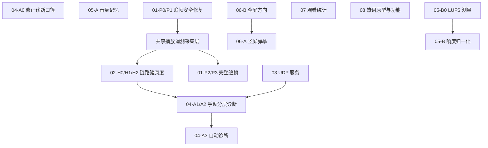

# 待实施计划：实施顺序与依赖总览

> 状态：执行索引，随实施进度持续更新
> 创建日期：2026-08-09
> 适用范围：`docs/待实施/` 下的 01–08 号设计
> 目的：固定修复顺序、依赖关系和开工条件，避免后续遗漏或把尚未验证的方案直接投入实现。
> 新增专题：快手全平台请求治理与 HarmonyOS 单直播间能力补齐见 [09-直播稳定性与鸿蒙能力补齐/00-修复总览与实施顺序](09-直播稳定性与鸿蒙能力补齐/00-修复总览与实施顺序.md)，该专题明确排除多开同屏。

---

## 1. 总原则

1. 先修已经有日志或代码证据支持的缺陷，再做新产品能力。
2. 先上线低风险保护和只观测逻辑，再让诊断结果控制播放器。
3. 播放缓存、进度、吞吐、缓冲等遥测只建立一套采集层；追帧策略、健康度和网络诊断分别消费，彼此不得循环调用。
4. 所有跨房间、切线、重开和异步任务必须绑定会话 generation；旧会话结果不得写入新房间。
5. 未完成产品口径或真机验证的项目，不因代码入口已经存在就直接实施。
6. 每完成一个阶段，应同步更新本文件的状态和对应设计文档。

## 2. 推荐实施顺序

### 第一批：明确缺陷与低风险修复

#### 1. 修正网络诊断错误口径（04-A0）

关联：[App 游戏式网络质量检测接入设计](04-App游戏式网络质量检测接入设计.md)

- 移除三个公共 DNS 地址固定 TCP 443 失败数的跨目标汇总。
- UI 不再把 TCP 连接失败称为“丢包率”。
- 只保留当前播放 URL 实际 host/port 的 TCP 可达性检查。
- 此阶段不依赖 UDP 服务，也不改变播放行为。

完成标准：不再出现“失败 6/12，因此丢包 50%”一类结论。

#### 2. 修复音量记忆链路（05-A）

关联：[音量统一设计](05-音量统一设计.md)

按以下顺序实施：

1. A1：`resetRoom` 完成新房间加载后重新施加用户音量。
2. A2：OHOS 播放器重建时传入当前用户音量。
3. A5：修复 `_volumeBeforeMute` 硬编码为 100 的问题。
4. A6：换房时正确重置静音状态。
5. A3：全量核查音量写入是否统一经过 `setSessionPlayerVolume`。
6. A4：移动端暂时保留系统音量手势，并增加播放器内部音量入口；不得未经确认直接改变现有手势语义。

完成标准：同平台换房、跨平台换房、退出重进和 OHOS 重建后音量保持一致；静音恢复到真实的静音前音量。

暂不实施：05-B 响度归一化。必须先完成 LUFS 样本测量 B0。

#### 3. 修复全屏方向跟随（06-B）

关联：[竖屏弹幕与全屏方向设计](06-竖屏弹幕与全屏方向设计.md)

按以下顺序实施：

1. media_kit 换房时立即重置 `isVertical`，消除继承上一房间方向的窗口。
2. 统一 OHOS 与 Android/iOS 的退出全屏方向恢复行为。
3. 将“全屏自动横屏”的默认值调整为关闭，使竖屏流默认保持竖屏。
4. 更新设置项说明文字。
5. 真机验证 iPad 竖屏全屏的状态栏限制，再决定是否采用 iPad 独立默认值。

范围边界：非全屏 16:9 letterbox 和竖屏弹幕列表不并入本次小修复。

#### 4. 修复追帧耗空缓存（01-P0/P1）

关联：[直播缓存追帧策略设计](01-直播缓存追帧策略设计.md)

按以下顺序实施：

1. P0：新旧策略 shadow mode 对照，只记录决策，不写播放器速度。
2. 用历史快手日志回放确认阈值和状态转换。
3. P1：恢复基准速度不受 dwell 限制；dwell 只约束加速或非紧急升档。
4. 增加 stopThreshold、预测耗尽保护、cooldown 和分段降速。
5. 自动档高缓存区最高先限制为 1.06，接近安全线逐级降至 1.0。

完成标准：缓存低于 stopThreshold 后不再继续加速超过一个采样周期；历史日志回放不再出现 `cache=0.510s, speed=1.068`。

范围约束：“极低延迟（赛事）”是新能力，不与本轮缺陷修复绑定发布。先保留设计和测试向量，待完整状态机及真机数据稳定后再开放。

### 第二批：统一观测基础与完整追帧策略

#### 5. 建立共享播放遥测采集层

关联：[直播缓存追帧策略设计](01-直播缓存追帧策略设计.md)、[直播链路健康度设计](02-直播链路健康度设计.md)、[App 游戏式网络质量检测接入设计](04-App游戏式网络质量检测接入设计.md)

- 缓存、播放进度、倍速、buffering、吞吐和欠载事件只采集一次。
- 统一携带采样时间、房间 generation、播放源标识和指标支持状态。
- 健康度按固定低频节奏消费；追帧状态下可请求更高频的单属性缓存采样。
- 禁止追帧、健康度和网络诊断各自创建重复的高频原生属性读取 Timer。

#### 6. 直播链路健康度 H0/H1/H2

关联：[直播链路健康度设计](02-直播链路健康度设计.md)

1. H0：模型、tracker、evaluator、日志回放和 shadow 日志。
2. 优先验证根因与证据；初期数字分数应视为实验值。
3. H1：手动诊断面板展示健康等级、主要原因和原始指标。
4. H2：补齐吞吐、音频欠载和结构化重连事件。

完成标准：快手历史日志稳定识别为“追帧消耗缓存”，正常直播不会因单点波动频繁跳级，unsupported 指标不会被当成 0。

#### 7. 完整追帧状态机 01-P2/P3

1. 接入 Settling、Monitoring、CatchingUp、Protecting、Cooldown。
2. 接入动态采样、缓存趋势和动态追帧预算。
3. 单开与多开复用同一 evaluator 和 policy。
4. P3 再按协议、平台和真机数据校准阈值。
5. 赛事档只有在 FLV/RTMP 真机数据证明 100–250ms 单属性采样可承受后才开放。

控制边界：健康度只提供观测信号，不能直接调用追帧服务；追帧服务不得触发播放器重开。

### 第三批：独立产品功能（当前暂缓）

#### 8. 观看统计（07，暂缓）

关联：[观看统计设计](07-观看统计设计.md)

开工前必须确定：

- 前台播放、后台音频、buffering、暂停、静音分别是否计时。
- 多开同时播放按总观看路数累计，还是按真实时间只累计一份。
- desktop 多窗口是否共享 Hive，以及如何避免重复计时和并发写入。
- 心跳周期、保留天数、默认开关状态和是否进入配置导入导出。

实现约束：

- 使用心跳聚合，但不能简单每次固定增加一个 tick。
- 使用单调时间计算真实间隔，并限制单次最大增量。
- 只有前后两个有效样本属于同一房间和同一会话时才累计；跨房切换的间隔不归给新房间。
- 按“日 × 站点 × 房间”聚合，并提供裁剪和清空入口。

#### 9. 弹幕热词（08，暂缓）

关联：[弹幕热词统计设计](08-弹幕热词统计设计.md)

先做无 UI 的真实弹幕语料原型，验证：

- 2/3 字 n-gram 的 TopN 是否具有可读性。
- 停用词和子串合并能否压住噪声。
- 同一句内重复 n-gram 是否只计一次，避免“哈哈哈哈”异常放大。
- 每个窗口的 key 基数上限、输入速率上限和清理成本。
- 高频弹幕下只 add、定时 flush 的 CPU 和内存表现。

只有原型达到可接受效果后，再接 Tab、列表和一键加入屏蔽词。不得退化成与“重点动态”重复的整句统计功能。

#### 10. 自建 UDP 测速与 App 接入（03、04-A1 以后）

关联：[自建 UDP 网络质量测速服务设计](03-自建UDP网络质量测速服务设计.md)、[App 游戏式网络质量检测接入设计](04-App游戏式网络质量检测接入设计.md)

1. 03-S0：协议、编解码、测试向量和丢包模拟器。
2. 03-S1：部署单节点服务，完成 Cookie、等长响应、限速和监控。
3. 04-A1：App 手动 UDP 测试和分层诊断 UI。
4. 04-A2：接入直播链路健康快照。
5. 03-S2/04-A3：多次真实缓冲后的低频自动检测，先只记录日志。
6. 03-S3：有实际需求和运维能力后再扩展多节点。

控制边界：UDP 结果只代表用户到自建节点的路径，不代表直播 CDN；不得因一次 UDP 异常自动重开、切线或降画质。

### 第四批：高不确定性能力

#### 11. 响度归一化（05-B）

1. B0：五个平台、每个平台至少五名主播、每路至少 60 秒的 LUFS 稳态测量。
2. 比较平台间均值差和平台内主播方差。
3. 平台差异主导时再考虑 B1 静态站点增益。
4. 主播差异主导时再评估 B2 `dynaudnorm`。
5. B2 必须与低延迟音频缓冲设计联合测试；延迟优先。

在 B0 完成前，不实现平台增益表或动态音频滤镜。

#### 12. 竖屏弹幕列表（06-A）

开工前必须确定：

- 列表叠在画面还是 letterbox 黑边。
- 与下方聊天 Tab 是否同时显示、是否共享滚动状态。
- 方向变化时旧弹幕清空还是保留。
- 默认是否开启，以及用户关闭入口。

实施前置：06-B 的 `isVertical` 换房重置已完成；控制栏高度和安全区偏移已抽成统一常量。

## 3. 依赖关系

04-A0、05-A、06-B 和 01-P0/P1 可以独立推进；它们不需要等待 UDP 服务或完整健康度系统。

## 4. 当前需要确认但不阻塞第一批的问题

1. iPad 是否保持“默认强制横屏”，以换取更可靠的状态栏隐藏。
2. 移动端播放器内部音量入口采用滑条按钮还是其他形式。
3. 赛事档是否作为实验功能隐藏，直到真机指标满足要求。
4. 观看统计的后台播放、多开和多窗口计时口径。
5. 热词原型采用的实际弹幕样本和质量验收标准。
6. UDP 服务的域名、端口、部署节点和运维责任。

## 5. 状态清单

状态标记：`[ ]` 未开始，`[~]` 进行中，`[x]` 已完成，`[-]` 暂缓。

- [x] 04-A0 修正网络诊断口径
- [x] 05-A 音量记忆修复
- [x] 06-B 全屏方向跟随
- [-] 01-P0 追帧 shadow mode，P1 已直接落地，本阶段不再补做旧策略影子对照
- [x] 01-P1 追帧安全保护
- [x] 共享播放遥测采集层
- [x] 02-H0 直播链路健康度纯领域层
- [x] 02-H1 手动诊断面板健康度展示
- [x] 02-H2 主播放器与多房间吞吐、欠载、结构化重连、重连 host 变化与恢复耗时已接入
- [x] 01-P2 完整追帧状态机、动态采样、趋势与预算，以及单房间/多房间接线
- [~] 01-P3 已接入协议、平台资源等级和多房间角色的保守档位；真实设备/协议阈值仍待样本校准
- [-] 01 赛事/极低延迟档继续关闭，等待 FLV/RTMP 真机高频采样数据
- [-] 07 观看统计口径与实现，按当前决定暂缓
- [-] 08 热词算法原型与实现，按当前决定暂缓
- [ ] 03 UDP 服务 S0/S1
- [ ] 04 UDP 手动接入 A1/A2
- [ ] 03/04 自动诊断与多节点
- [-] 05-B 响度归一化，等待 B0 测量
- [-] 06-A 竖屏弹幕列表，等待产品决策与 06-B

### 5.1 2026-08-09 第一、二批收尾记录

- 实施范围：第一批 04-A0、05-A、06-B、01-P1，以及第二批共享遥测、02-H0/H1/H2、01-P2 和 P3 保守档位。
- 明确未实施：03/04 UDP 服务与接入、05-B、06-A、07、08，以及依赖真机数据的赛事档和激进阈值校准。
- 共享采样决策：单房间和多房间均使用无重叠 one-shot 调度；同一轮 `demuxer-cache-duration` 只读取一次，健康度、追帧和诊断消费同一缓存样本。
- 多房间决策：聚焦房间优先；主次布局仅主房间追帧；等分布局和次房间只保留低频健康采样，不执行加速。
- 安全边界：切源、重开、暂停、前后台和销毁均使用 generation/control token/intent revision 拒绝迟到结果；OHOS 不宣告不支持的追帧或自动重连成功。
- 最终验证：7 组聚焦 Flutter 测试共 68 项全部通过；9 个最终改动文件静态分析 0 问题；提交前补丁检查无空白错误。
- 第一批提交：`6722124`、`6e94c51`、`791298a`、`3206b7e`。
- 第二批提交：`29bbd6a`、`c440fdf`、`ea08a41`、`f051386`、`c6ae755`、`89e10c7`、`82e9e28`、`7fcbedd`、`1a256e5`。

## 6. 每次实施后的更新要求

完成或开始任一项目时，应同步记录：

1. 更新第 5 节状态标记。
2. 在对应设计文档顶部更新实施状态。
3. 记录实际改动文件和新增测试。
4. 记录与设计不同的实现决策及原因。
5. 真机校准类项目记录设备、平台、协议、样本时长和结果。
6. 若发现新的依赖或阻塞，先更新本文件再继续扩展范围。
