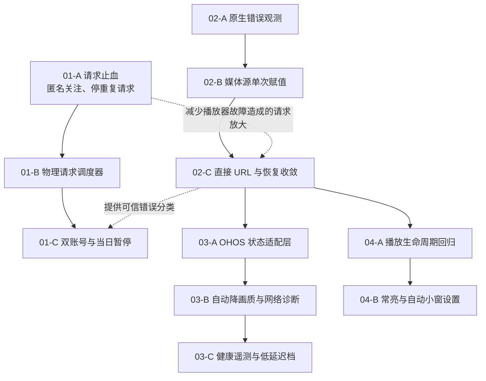

# 直播稳定性与 HarmonyOS 能力补齐：修复总览与实施顺序

> 状态：待实施总览
> 创建日期：2026-08-09
> 范围：快手全平台请求治理、HarmonyOS 单直播间播放稳定性与能力补齐
> 明确排除：多开同屏

## 1. 一句话结论

先并行处理“快手请求止血”和“HarmonyOS AVPlayer 起播稳定性”，再落双账号容灾；播放器状态可信后补自动降清晰度、网络诊断和遥测；低延迟最后开放。屏幕常亮与自动小窗设置可作为独立低风险批次穿插实施。

## 2. 文档拆分

| 文档 | 解决问题 | 平台 |
| --- | --- | --- |
| [01-快手全平台请求与双账号治理](01-快手全平台请求与双账号治理.md) | 匿名关注刷新、物理请求限速、双账号、频繁到次日、Cookie 生命周期 | 全平台 |
| [02-HarmonyOS直播起播与恢复稳定性](02-HarmonyOS直播起播与恢复稳定性.md) | 快手转圈、抖音首次黑屏、媒体源竞态、错误吞掉、恢复请求放大 | HarmonyOS |
| [03-HarmonyOS自适应播放与诊断能力补齐](03-HarmonyOS自适应播放与诊断能力补齐.md) | 自动降清晰度、网络诊断、健康遥测、AVPlayer 低延迟档位 | HarmonyOS |
| [04-HarmonyOS系统体验与播放器设置补齐](04-HarmonyOS系统体验与播放器设置补齐.md) | 屏幕常亮、自动小窗设置、能力化设置、已有能力回归 | HarmonyOS |

## 3. 问题清单与优先级

| 优先级 | 问题 | 影响 | 对应文档 |
| --- | --- | --- | --- |
| P0 | HarmonyOS 快手部分房间永久转圈 | 无法观看，并放大快手请求 | 02 |
| P0 | HarmonyOS 抖音首次黑屏需刷新 | 首次进房失败 | 02 |
| P0 | 快手播放/关注/回退产生过多登录请求 | 全平台账号请求频繁 | 01 |
| P0 | AVPlayer 错误被吞掉 | 无法判断和正确恢复 | 02 |
| P1 | 关注列表使用登录态完整详情 | 不必要消耗账号额度 | 01 |
| P1 | 限流只包外层任务 | 内部物理请求仍可突发 | 01 |
| P1 | 账号频繁后短冷却反复探测 | 延长或加重限制 | 01 |
| P1 | 播放时未保持屏幕常亮 | 长时间观看可能熄屏 | 04 |
| P1 | OHOS 自动小窗能力已有但设置不可见 | 功能无法正常配置 | 04 |
| P2 | OHOS 自动降清晰度未启用 | 弱网恢复能力较差 | 03 |
| P2 | OHOS 自动网络诊断未接入 | 提示与定位能力不足 | 03 |
| P2 | OHOS 健康遥测不完整 | 诊断面板数据不足 | 03 |
| P3 | OHOS 无安全的低延迟档位 | 延迟控制能力低于 mpv 路径 | 03 |
| P3 | OHOS 设置页缺少 AVPlayer 等价设置 | 用户无法调整有效能力 | 03/04 |
| P3 | OHOS/手动 Cookie 到期时间常为未知 | 无法提前给出准确重登时间 | 01 |

Cookie 到期时间受系统 API 限制，不承诺所有平台都能补齐准确值；目标是正确展示“已知/未知/失效”，而不是生成推测日期。

## 4. 依赖关系

关键判断：

- 01-A/01-B 与 02-A/02-B 可以并行实施。
- 双账号切换必须建立在物理请求调度器之上，否则切账号会绕过设备/IP 间隔。
- 自动降画质和诊断必须等原生状态、首帧和错误事件可信后接入。
- 低延迟参数必须等起播稳定性真机通过后开放。
- 常亮原生桥可以独立开发，但最终生命周期验收应与修复后的播放器一起进行。

## 5. 与现有待实施设计的关系

本目录不重复通用算法，继续引用既有设计：

| 既有文档 | 与本目录关系 |
| --- | --- |
| [../01-直播缓存追帧策略设计](../01-直播缓存追帧策略设计.md) | OHOS 低延迟只有在遥测能力足够时接入其安全状态机 |
| [../02-直播链路健康度设计](../02-直播链路健康度设计.md) | 03 只补 OHOS 采集与 unsupported 语义 |
| [../04-App游戏式网络质量检测接入设计](../04-App游戏式网络质量检测接入设计.md) | 03 复用真实端点诊断口径，不重复网络产品设计 |
| [../05-音量统一设计](../05-音量统一设计.md) | 02/04 生命周期回归需要覆盖 OHOS 重建后的音量保持 |
| [../06-竖屏弹幕与全屏方向设计](../06-竖屏弹幕与全屏方向设计.md) | 02/04 真机回归覆盖全屏、方向、弹幕和 PiP |

多开同屏被明确排除，不纳入任何依赖或验收。

## 6. 推荐发布批次

### R0：只观测，不改变行为

目标：先获得可信证据。

- AVPlayer 状态、媒体源赋值阶段和错误码脱敏上报。
- 快手每个真实 HTTP 请求按匿名/账号槽位/来源计数。
- 记录详情任务内部物理请求数。
- 日志不包含 URL、Cookie、Token、DID。

退出条件：失败房间能明确落到原生状态错误、首帧超时、地址 HTTP 错误或其他分类。

### R1：P0 稳定性与请求止血

- 消除 AVPlayer 重复设置媒体源。
- 空 headers HTTP-FLV 恢复直接 URL 路径。
- 原生错误传回 Flutter。
- 缓冲恢复先重建本地播放器，不请求详情。
- 活跃播放期间停止高频快手详情轮询。
- 登录态明确 live/offline 后不匿名二次确认。

退出条件：快手失败样本和抖音首次进入真机通过；持续缓冲不再产生周期详情请求。

### R2：匿名关注与物理请求调度

- 关注列表切换匿名状态接口。
- 匿名和登录会话隔离。
- 物理请求级单路调度、间隔、抖动和 single-flight。
- DID、弹幕凭证和回退请求收敛。

退出条件：全平台刷新快手关注列表时登录态请求数为 0。

### R3：双账号与账号生命周期

- 抽取独立 `KuaishouAccountSession`。
- 增加主/备槽位和单向降级账号池。
- 分离 `invalid`、`cooldown`、`suspended`。
- 持久化次日 0 点暂停和 Cookie 到期/验证信息。
- 两账号不可用时匿名播放无弹幕。

退出条件：主账号只切备用一次，备用失败只进匿名；重启后状态保持。

### R4：系统体验补齐

- OHOS 原生窗口常亮桥与 lease。
- 自动小窗、隐藏弹幕设置按能力显示。
- 前后台、PiP、暂停和 dispose 生命周期回归。
- 已有截图、分享、通知、同步和网页登录回归。

退出条件：长时播放不熄屏，退出房间可正常熄屏，自动 PiP 行为符合设置。

### R5：自适应播放与诊断

- OHOS 统一状态适配层。
- 自动降清晰度，首版只降不升。
- 当前真实端点网络诊断。
- 健康指标支持矩阵和数据不足展示。

退出条件：弱网保守降档、无请求放大、诊断不把播放器错误误报为网络错误。

### R6：低延迟与高级能力

- 基于真机数据开放稳定/自动/低延迟实验档。
- 只映射 AVPlayer 真正支持的参数。
- 不支持的 mpv 指标和设置保持隐藏/unsupported。

退出条件：低延迟档不降低首帧成功率，不重新引入快手转圈或抖音黑屏。

## 7. 代码边界

| 层 | 职责 | 禁止 |
| --- | --- | --- |
| `simple_live_core` 快手站点 | 匿名/登录请求、解析、错误事实 | 读取 Flutter UI 状态 |
| App 快手账号服务 | 双账号、持久化、账号选择 | 执行原始 HTTP 请求 |
| FollowService | 可见项调度、展示缓存 | 使用登录态刷新关注 |
| HarmonyOS video_player 插件 | AVPlayer 状态机、原生错误 | 决定账号或业务重试 |
| OHOS widget/controller | generation、生命周期、本地重建 | 静默吞原生错误 |
| LiveRoomController | 有限恢复、画质/线路业务决策 | 用普通 buffering 高频刷新详情 |
| Display/PiP 服务 | 常亮、小窗原生能力 | 读取站点 Cookie |

## 8. 跨文档安全规则

- 所有异步结果绑定 room/player/session generation。
- 所有自动恢复 single-flight，并有 cooldown 和最大次数。
- 播放器错误不能触发账号暂停。
- 账号 403/429 不能标记为 Cookie 到期。
- 健康评分不能直接调用播放器恢复。
- 自动降画质不能绕过快手物理请求调度器。
- 不支持指标标记 unsupported，不按 0 计算。
- 匿名请求不得共享登录 CookieJar。
- 任意日志不得记录敏感 URL 或认证数据。

## 9. 总体验收矩阵

| 场景 | 预期 |
| --- | --- |
| 快手两个历史失败房间首次进入 | 正常首帧，无永久 buffering |
| 抖音首次进入 | 无需手动刷新 |
| 快手关注刷新 | 登录态请求 0 |
| 快手连续观看 30 分钟 | 无周期性登录详情请求 |
| 主账号明确频繁 | 单向切备用，主账号停止 |
| 备用账号也频繁 | 匿名画面、无弹幕、无账号重试 |
| Cookie 明确失效 | 标记 invalid，提示重新登录，不等 0 点恢复 |
| OHOS 长时前台播放 | 屏幕保持常亮 |
| OHOS 退出播放 | 常亮释放 |
| OHOS 自动 PiP | 设置可见且行为正确 |
| OHOS 弱网 | 保守降画质，无振荡和请求放大 |
| OHOS 诊断 | 区分端点不可达与播放器初始化错误 |
| OHOS 低延迟实验档 | 不降低起播成功率，可快速回滚 |

## 10. 完成定义

全部任务完成需要同时满足：

1. 四份子文档的单元测试与真机验收项完成。
2. Android、iOS、HarmonyOS 和至少一个桌面端完成快手请求量回归。
3. HarmonyOS 完成快手/抖音、Wi-Fi/蜂窝、前后台/PiP/方向矩阵。
4. 发布日志可以证明请求量下降且没有敏感信息泄漏。
5. 任一实验能力都有关闭开关和明确回滚路径。
6. 多开同屏不作为本批次完成条件，也不在本批次顺带实现。
